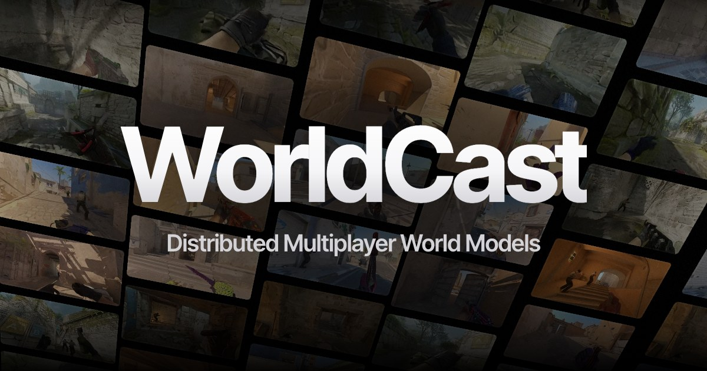
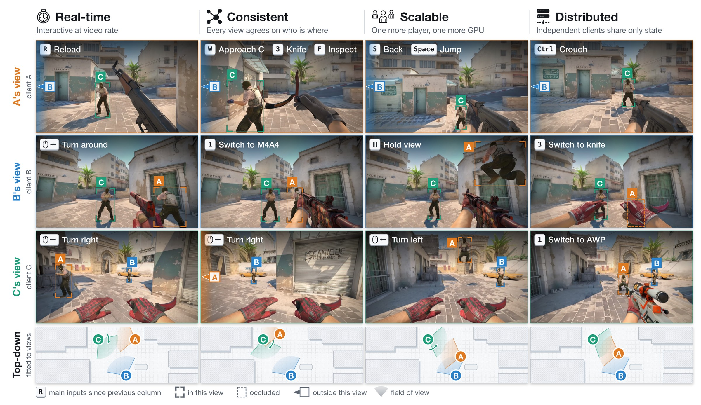
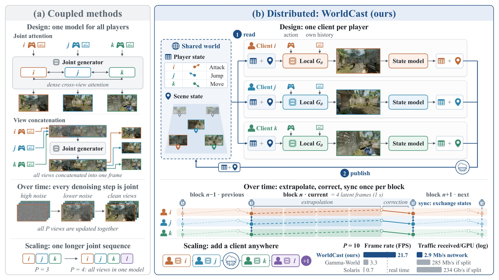

<p align="center">
  
</p>

<h1 align="center">WorldCast: Distributed Multiplayer World Models</h1>

<p align="center">
  <a href="https://ziyang-ye.github.io/">Ziyang Ye</a><sup>1</sup>&ensp;
  <a href="https://junchao-cs.github.io/">Junchao Huang</a><sup>1,2</sup>&ensp;
  Evelyn Zhang<sup>2</sup>&ensp;
  Zhihao Xie<sup>1</sup>&ensp;
  Ruicheng Zhang<sup>3</sup>&ensp;
  Boyao Han<sup>1</sup><br>
  Litao Ban<sup>4</sup>&ensp;
  Ziye Wang<sup>4</sup>&ensp;
  <a href="https://joyhuyy1412.github.io/">Xinting Hu</a><sup>5</sup>&ensp;
  <a href="https://shishaoshuai.com/">Shaoshuai Shi</a><sup>4</sup>&ensp;
  <a href="https://zhuotaotian.github.io/">Zhuotao Tian</a><sup>2</sup>&ensp;
  <a href="https://llijiang.github.io/">Li Jiang</a><sup>1,2&dagger;</sup>
</p>

<p align="center">
  <sup>1</sup>CUHK-Shenzhen&ensp;
  <sup>2</sup>SLAI&ensp;
  <sup>3</sup>Tsinghua SIGS&ensp;
  <sup>4</sup>Voyager Research, Didi Chuxing&ensp;
  <sup>5</sup>USTC<br>
  <sup>&dagger;</sup>Corresponding author
</p>

<p align="center">
  <a href="https://arxiv.org/abs/2610.12412"></a>
  <a href="https://ziyang-ye.github.io/WorldCast-Page/"></a>
  <a href="https://huggingface.co/ZiyangYe/WorldCast"></a>
  <a href="LICENSE"></a>
</p>

<p align="center"><b>TL;DR: WorldCast is a distributed multiplayer world model: each player runs a local client with its own video generator and state model, and on Counter-Strike 2 the camera-aligned player state field raises player rendering rates by over an order of magnitude over joint-generation methods.</b></p>

<p align="center"></p>

## Overview

Multiplayer world models must generate independently controlled views that stay consistent in both the players and their shared environment. Most existing approaches couple the players through joint multi-view generation, whose cost grows with every added player. **WorldCast** is a distributed multiplayer world model: each player runs a local client with its own video generator and state model.

- **Player state.** A state model, trained on recorded player positions and map geometry, estimates each player's position from its generated video and controls. Clients exchange player states and project them into camera-aligned player state fields that guide where and how the other players are rendered.
- **Scene state.** A shared memory bank of generated blocks lets clients reuse each other's observations, which keeps the scene consistent across views.
- **Distributed by design.** Each client runs in real time on its own GPU and exchanges only player and scene states, so multiplayer generation has no centralized computational bottleneck.

On Counter-Strike 2, the camera-aligned player state field raises player rendering rates by over an order of magnitude over joint-generation methods, shared scene state improves visual consistency over whole rounds, and image quality stays stable over hour-long rollouts.

<p align="center"></p>
<p align="center"><em>(a) Coupled designs generate all players' views in one model. (b) Each WorldCast player runs its own client, and clients exchange only the shared world state.</em></p>

## Release plan

- [x] Inference
- [x] Weights
- [x] State model
- [x] Training and evaluation
- [ ] Data preparation (coming soon)
- [ ] Deployable inference (coming soon)

## Quick start

### Install

```bash
git clone https://github.com/Ziyang-Ye/WorldCast && cd WorldCast
conda env create -f environment.yml && conda activate worldcast    # Python 3.10, torch 2.9.1 (CUDA 12.8), the package and its extras
pip install flash-attn==2.8.3 --no-build-isolation                  # FlashAttention-2 (optional; for latents bit-exact with the paper)
```

Run every command from the repository root. For another CUDA build edit the index in `environment.yml`; to install into an existing environment, `pip install torch && pip install -e .`. Without flash-attention, add `--set model.attention=sdpa` to a tool (extras, attention kernels and GPU memory: [docs/installation.md](docs/installation.md)).

### Weights

```bash
python tools/download_weights.py --out-dir weights
```

Fetches the four-step generator, the state model, the depth head with its read-out and the prompt embedding from [ZiyangYe/WorldCast](https://huggingface.co/ZiyangYe/WorldCast), plus the Wan2.2 VAE and tokenizer, and writes `weights/paths.yaml` for the commands below. Files and checksums: [docs/inference.md](docs/inference.md#weights).

### Examples

```bash
python tools/download_examples.py --out-dir examples   # six recorded rounds
bash examples/run.sh mirage_r16                        # three clients, one GPU each
```

A case runs the clients of a recorded round in lockstep on their GT player states, decodes them and tiles the views into `runs/examples/mirage_r16/grid.mp4`. Each client's `latents.npy` and `video.mp4` are under `runs/examples/mirage_r16/<round>/<media_id>/`.

The [closed loop](docs/inference.md#closed-loop), where the clients take their positions from the state model, is the same case with a setting and a new output directory (`run.sh` starts only on one that does not exist):

```bash
OUT=runs/examples/mirage_r16_closed_loop bash examples/run.sh mirage_r16 --set player_state.source=predicted
```

The other five cases: [examples/README.md](examples/README.md); the 32 rounds of Table 3: [docs/reproduce.md](docs/reproduce.md).

## Training and evaluation

### Training

```bash
pip install -e ".[train]"
cp examples/train_paths.yaml train_paths.yaml   # then point it at the data
torchrun --nnodes 8 --nproc_per_node 8 --node_rank $RANK --master_addr $MASTER --master_port 29500 \
  tools/train.py --config configs/train/stage2.yaml --config train_paths.yaml \
  --set run.output_dir=runs/stage2 --set checkpoint.init=runs/stage1_long/checkpoint_model_006000/model.pt
```

One config per stage in `configs/train/`; each stage starts from the checkpoint the previous stage of your run wrote (`checkpoint.init`). Training reads [OpenCS2](https://huggingface.co/datasets/blanchon/opencs2_dataset) and files derived from it ([docs/data.md](docs/data.md)). Every stage's command and its checkpoints: [docs/training.md](docs/training.md).

<details><summary>The stages and their configs</summary>

| stage | config | trains | starts from |
|---|---|---|---|
| 1 | `stage1.yaml` | Wan2.2-TI2V-5B, bidirectional, on gameplay: 5 s windows | Wan2.2-TI2V-5B |
| 1_long | `stage1_long.yaml` | stage 1 continued on 10 s windows | stage 1 |
| 2 | `stage2.yaml` | + the player state field | stage 1_long |
| 2s | `stage2s.yaml` | + the scene state (memory frames) | stage 2 |
| 3 | `stage3.yaml` | block-causal, teacher forcing | stage 2s |
| 4 | `stage4.yaml` | four-step distribution matching distillation: the released generator | stage 3; teacher and critic: stage 2 (`distillation.teacher`, `distillation.critic`) |

`stage3_noscene.yaml` and `stage4_noscene.yaml` train without scene state, `configs/train/ablations/` holds the ablations.
</details>

### Evaluation

```bash
pip install -e ".[eval]"
torchrun --nproc_per_node 4 tools/evaluate.py --config configs/train/stage2.yaml --config train_paths.yaml \
  --checkpoint runs/stage2/checkpoint_model_025000/model_ema.pt --out runs/eval/stage2.json
```

Writes PSNR, SSIM and LPIPS on the 64 validation windows (`validation.index` of `train_paths.yaml`), overall, per map and per window. A stage-4 config scores the four-step generator. Samplers and options: [docs/training.md](docs/training.md#evaluation).

## Code structure

```
WorldCast/
├── worldcast/   the package: modeling/ (generator, state model, depth head), player_state/, scene_state/,
│                sampling/, engine/ (inference/, training/), data/, config/
├── tools/       one script per command: python tools/<name>.py --help
├── configs/     train/ (stage and ablation configs), state_model/ (cell and speed tables)
├── examples/    the six recorded rounds, run.sh, the reference fingerprints
├── docs/        installation, inference, training, data, reproduce
└── tests/       CPU tests mirroring the package: pip install -e ".[test]" && python -m pytest tests -q
```

## Citation

If you find WorldCast useful, please cite:

```bibtex
@article{ye2026worldcast,
  title   = {WorldCast: Distributed Multiplayer World Models},
  author  = {Ye, Ziyang and Huang, Junchao and Zhang, Evelyn and Xie, Zhihao and Zhang, Ruicheng and Han, Boyao and Ban, Litao and Wang, Ziye and Hu, Xinting and Shi, Shaoshuai and Tian, Zhuotao and Jiang, Li},
  journal = {arXiv preprint arXiv:2610.12412},
  year    = {2026}
}
```

## Acknowledgements

WorldCast builds on [Wan2.2](https://github.com/Wan-Video/Wan2.2) (Wan2.2-TI2V-5B) and is trained and evaluated on the [OpenCS2 dataset](https://huggingface.co/datasets/blanchon/opencs2_dataset) (CC BY 4.0).

## License

Apache-2.0 ([LICENSE](LICENSE)); third-party code and weights: [NOTICE](NOTICE).
