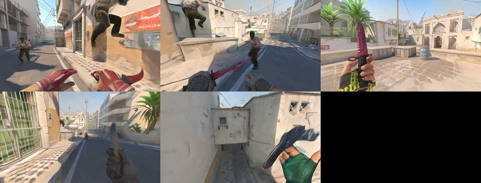
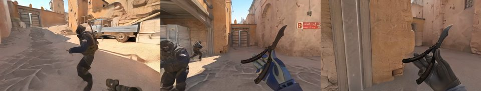
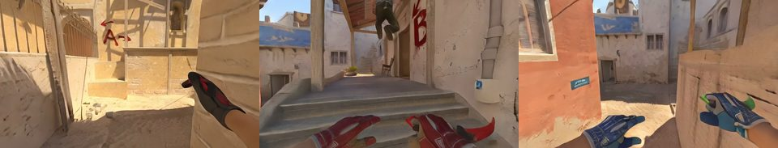
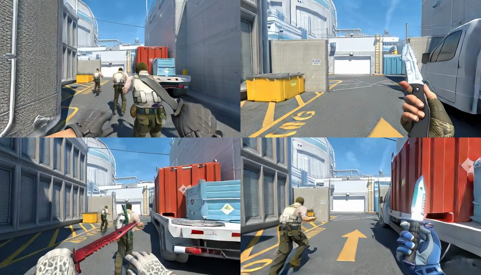
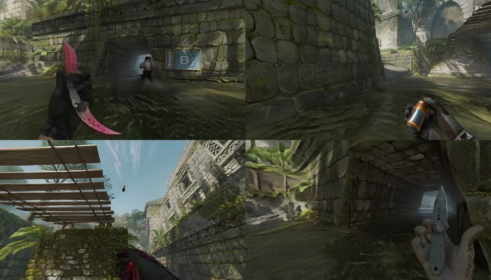
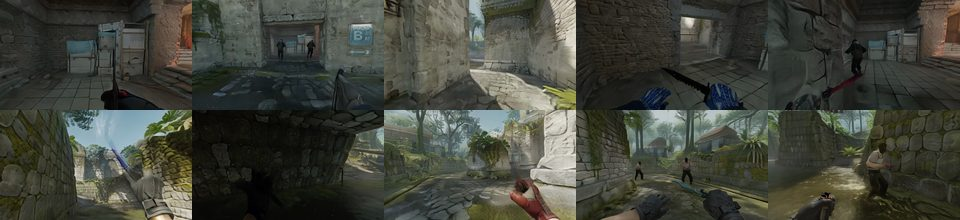

# Examples

Six recorded Counter-Strike 2 rounds to render with the released weights, at least one per map. Every client renders
one player's view from that player's recorded controls and the recorded positions of all ten players (GT player
states, as in the paper's Table 3). The clients of a round run in lockstep, one GPU each, and share their generated
blocks.

| case | map | match, round | clients | length | GPUs | preview |
|---|---|---|---|---|---|---|
| `dust2_r09` | Dust2 | 2392774, r09 | 5 (T: p05-p09) | 20 s | 5 |  |
| `dust2_r16` | Dust2 | 2392809, r16 | 3 (CT: p06-p08) | 30 s | 3 |  |
| `mirage_r16` | Mirage | 2393226, r16 | 3 (T: p00-p02) | 30 s | 3 |  |
| `nuke_r07` | Nuke | 2393223, r07 | 4 (T: p05-p08) | 20 s | 4 |  |
| `ancient_r18` | Ancient | 2393400, r18 | 4 (T: p00-p02, p04) | 20 s | 4 |  |
| `ancient_r02` | Ancient | 2392968, r02 | 10 (all) | 60 s | 10 |  |

A client needs about 15 GiB of GPU memory, so a GPU can run as many clients as its memory holds: the GPUs column is
one GPU per client, and with fewer GPUs the clients take them in turn, with the same latents (`ancient_r02` on eight
GPUs: GPUs 0 and 1 run two clients each).

## Get the data

After [Install](../README.md#install) and [Weights](../README.md#weights):

```bash
python tools/download_examples.py --out-dir examples        # all six cases, 200 MB; or name some: ... mirage_r16
python tools/check_examples.py examples/data/*/config.yaml  # CPU only: every client's inputs load, each first
                                                            # frame is the reference run's
```

The files come from the WorldCast repository on Hugging Face (as the weights do); `--source <dir>` takes them from a
local copy of the repository instead, a directory that holds its `examples/` as the Hub does, checked by the same
sha256. A case holds the files of [docs/inference.md](../docs/inference.md#data): `round_index.jsonl` (one row per client) and
`media_index.jsonl` (all ten players) are in `examples/data/<case>/`; the download puts `opencs2/` (their tick
tables), `first_latents/`, `vislabels/` and `obslabels/` into `<out-dir>/data/<case>/`, the expected video into
`<out-dir>/expected/`, and writes `<out-dir>/data/<case>/config.yaml` with these paths and the length. Another
`--out-dir` keeps the data outside the checkout (then `DATA=<out-dir> bash examples/run.sh <case>`). The recorded
videos of the rounds are in OpenCS2 (`video_path` in `media_index.jsonl`).

## Render

```bash
bash examples/run.sh dust2_r09
bash examples/run.sh dust2_r16
bash examples/run.sh mirage_r16
bash examples/run.sh nuke_r07
bash examples/run.sh ancient_r18
bash examples/run.sh ancient_r02    # ten clients: on eight GPUs, GPUs 0 and 1 run two each
```

### What run.sh does

1. Checks the inputs (`tools/check_examples.py`).
2. Runs the clients with `tools/run_session.py` in lockstep on the visible GPUs in turn: one GPU each where there are
   enough, else two or more to a GPU, as its log says.
3. Decodes each client's latents with `tools/decode.py` on the session's GPUs, the GPUs at once (one VAE per GPU).
4. Tiles the clients' videos with ffmpeg into `grid.mp4`, in player-slot order, left to right and top to bottom.
5. Prints a summary: where the outputs are; the frames `grid.mp4` (and `showcase.mp4`) decode to out of the
   session's, 1 + 4 (N - 1) for the N latents of its shortest client; and the comparison of the latents with the
   reference run's ([Expected output](#expected-output)), where a difference is reported, not fatal.

`tools/decode.py`, `grid.sh` and `tools/make_showcase.py` write a video under a hidden name and keep it only if it
decodes without error to every frame encoded; a video that fails this, or one short of the session's frames, stops the
run.

### Arguments and variables

- Arguments after the case go to `tools/run_session.py`: `--gpus 4,5,6` (one visible GPU per client), `--device cpu`
  (the decode follows), `--set model.attention=sdpa`, `--set player_state.source=predicted` (the
  [closed loop](../docs/inference.md#closed-loop); its latents are not compared with the reference run's).
- `WEIGHTS`: the weights paths file (default `weights/paths.yaml`). `DATA`: the directory of the downloaded examples
  (default `examples`). `OUT`: the output directory (default `runs/examples/<case>`). `PYTHON`: the interpreter.
  `SHOWCASE=1` adds [the showcase](#the-showcase).
- A session needs a fresh world-state directory: `OUT` must not exist, so remove it before running a case again or
  give another `OUT`.
- The clients poll the shared world state every 50 ms (`world_state.poll_s`; 2 s by default).

### Output layout

```
runs/examples/<case>/
  grid.mp4                           the clients' views tiled
  showcase.mp4                       with SHOWCASE=1
  <round>/<media_id>/                one directory per client: latents.npy, video.mp4, client.json, client.log
  <round>/world_state/               the session's shared world state
```

### Clients on several machines

`tools/run_session.py` gives every client the environment of the reference runs (`CLIENT_ENV` in
`worldcast/engine/inference/session.py`) where the caller's environment does not set a variable; a value set before
wins. The thread count (`OMP_NUM_THREADS`, `MKL_NUM_THREADS`) changes the speed, not the latents. Ten clients on two
machines that share a file system: start five clients on each with `tools/run_client.py`, with one world-state
directory and that environment, then decode and tile on either machine.

```bash
P=runs/examples/ancient_r02                     # on the shared file system
export PYTHONHASHSEED=0 OMP_NUM_THREADS=4 MKL_NUM_THREADS=4 PYTHONUNBUFFERED=1
for i in 0 1 2 3 4; do                          # on the second machine: 5 6 7 8 9
  CUDA_VISIBLE_DEVICES=$((i % 5)) python tools/run_client.py --config weights/paths.yaml \
      --config examples/data/ancient_r02/config.yaml \
      --index-row $i --world-state-dir $P/world_state --out-dir $P/p$i &
done; wait

python tools/decode.py --config weights/paths.yaml --latents $P/p?/latents.npy
bash examples/grid.sh $P/grid.mp4 $P/p?/video.mp4
python tools/verify_reference.py check $P
```

## The showcase

```bash
SHOWCASE=1 bash examples/run.sh mirage_r16
```

also writes `runs/examples/mirage_r16/showcase.mp4` (`tools/make_showcase.py`, on the CPU), which shows the GT
player states the clients ran with:

- each client's view, labelled with its player (P1-P10, each in its own colour) and team;
- in each view, a box at every other living player's recorded position within the view's width, projected into the
  client's recorded camera as the player state field projects players (`player_boxes` of
  `worldcast/player_state/projection.py`): its foot at the player's feet, as tall as the body; bold where the field's
  gate passes the player (the client's GT visibility label of the frame has it in view), thin where it does not;
  named above it where the name covers neither the view's label nor a nearer player's name or box; boxes and names
  on a black edge;
- no boxes in a view that shows the scope (black around a lit disc); its label says `scoped: no boxes`;
- beside the views, the round from above: the ten players with their trails (the last 3 s) over the faint paths of
  the whole round, which outline the map, and each client's field of view, between the time and the legend.

The boxes mark where the player state field places the other players. `--session` takes any finished session, e.g.
`$P` of the two-machine recipe above, after its decode:

```bash
python tools/make_showcase.py --config examples/data/ancient_r02/config.yaml --session $P --out $P/showcase.mp4
```

## Expected output

`examples/expected/<case>.mp4`, downloaded with the data, is the reference run of the case, made with the released
generator and the paper's settings, in the layout of `grid.mp4`. On the reference stack
([docs/reproduce.md](../docs/reproduce.md#bit-exact-reproduction)) the latents equal the reference run's; this
compares them with its recorded fingerprints (latents 0-24 of every client, and all latents where the reference run
had the case's length):

```bash
python tools/verify_reference.py check runs/examples/dust2_r09
```

## No GPU

Without a GPU, a case can still be checked and watched, with its GT player states drawn in: `tools/check_examples.py`
loads every client's inputs on the CPU, `examples/expected/<case>.mp4` is the case's reference run, and
`tools/make_showcase.py --expected` draws [the showcase](#the-showcase) over it. The tick tables need pyarrow
(`pip install -e .`), the showcase Pillow (`pip install -e ".[showcase]"`).

```bash
python tools/download_examples.py --out-dir examples mirage_r16
python tools/check_examples.py examples/data/mirage_r16/config.yaml
python tools/make_showcase.py --config examples/data/mirage_r16/config.yaml \
    --expected examples/expected/mirage_r16.mp4 --out runs/showcase/mirage_r16.mp4
```
